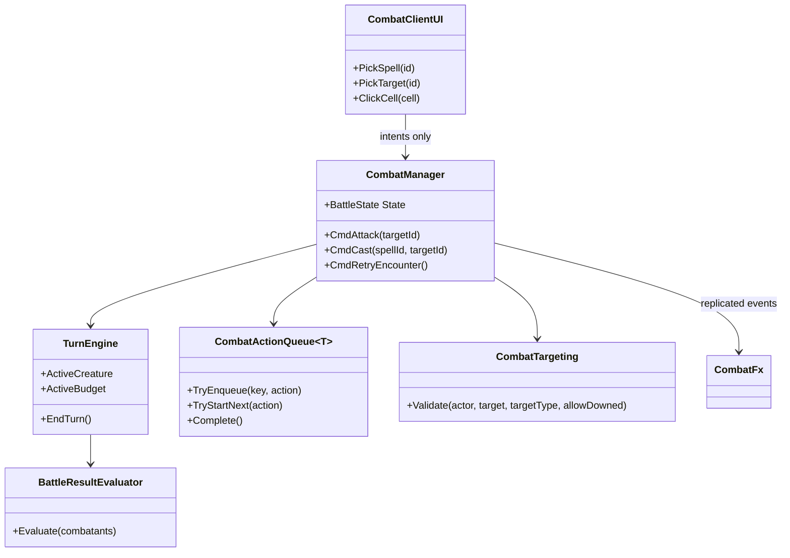
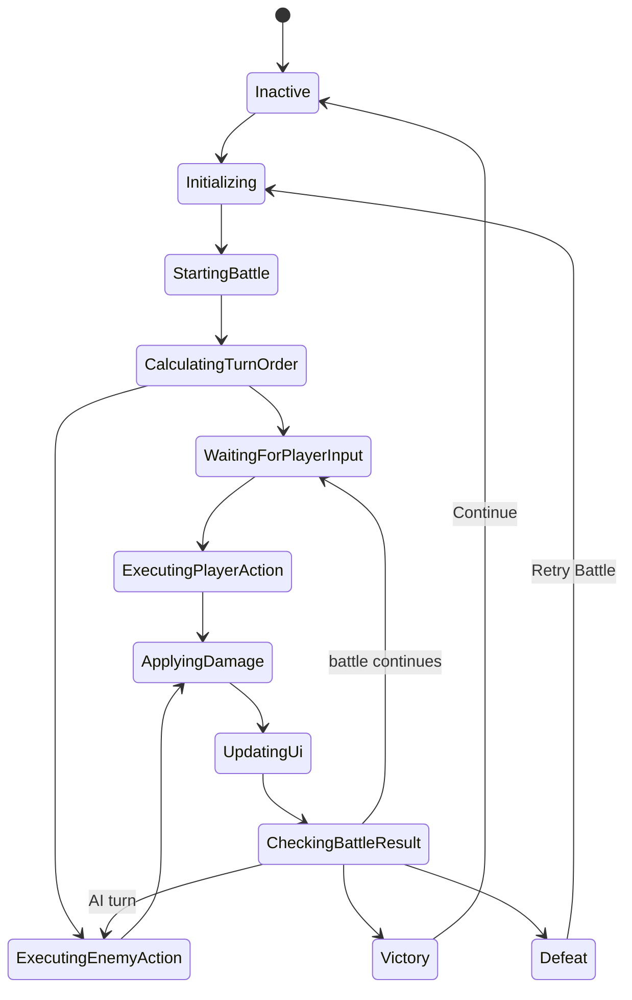

# Combat system

This is the implemented design for Radiant Pool's server-authoritative, turn-based tactical
combat. It adapts `combat.md` to the project's SRD action economy, spell slots, co-op party,
and grid movement. No extra package is required.

## Architecture

Rules and presentation remain separate:

- `rules/RadiantPool.Rules/CombatFlow.cs` owns battle states, target validation, result
  evaluation, the serial action queue, and the impact/timeout timeline.
- `CombatMath.cs`, `Spells.cs`, and `TurnEngine.cs` own deterministic attacks, spell effects,
  health clamping, resources, initiative, defeated-unit skipping, and action budgets.
- `game/Assets/Scripts/Combat/CombatManager.cs` is the authoritative network adapter. It
  accepts intents, validates range/ownership/resources, sequences one action, and broadcasts
  state plus presentation events.
- `CombatClientUI.cs` owns direct world attacks, individual spell target selection, overhead
  monster HP/shape markers, and status presentation. It never applies damage or spends resources.
- `CombatFx.cs`, `CharacterVisuals.cs`, and `GameAudio.cs` render replicated wind-up and
  impact events. Missing `Cast`/`Victory` parameters safely fall back to `Attack`.



## Battle state and turn flow

Only the server advances `BattleState`; clients observe it to lock input and explain what is
happening.



An action resolves in this order:

```mermaid
flowchart LR
    A[Enemy world click or named ability] --> B[Server validates actor, target, range, budget, slot]
    B --> C[Enqueue one action and lock input]
    C --> D[Broadcast wind-up: face, move, attack or cast animation, audio and VFX]
    D --> E[Configured impact time or fallback timeout]
    E --> F[Rules engine applies attack or spell]
    F --> G[Broadcast impact, reaction, damage number and exact HP]
    G --> H[Evaluate victory or defeat]
    H --> I[Unlock input or show modal]
```



The fallback timeline is deliberate: an absent animation event cannot strand combat. Damage
still occurs at the configured visual impact time, never when the menu button is pressed.

## Data model

`AttackDefinition` and `SpellDefinition` are the data-driven ability definitions. They carry
the rules fields plus presentation adapters: id/name/description, damage and delivery,
range/target type, resource level, animation trigger, VFX/audio ids, impact delay, movement
requirement, critical eligibility, cooldown placeholder, and effect operations. Spells use
SRD spell slots rather than a generic MP pool.

This project uses pure-C# definitions shaped for the project's content schema instead of
Unity `ScriptableObject` assets. Monster data is mirrored to JSON; the ten-spell v1 catalog
remains self-contained in `SpellLibrary`. This equivalent configuration keeps core combat testable
without Unity and prevents clients from owning editable rule assets. Unity presentation ids
remain replaceable through `Resources/SpellIcons`, `Resources/Music`, character prefabs, and
the FX/audio adapters.

An optional prefab under `Resources/CombatVfx/<visualEffectId>` is instantiated by the
presentation adapter at impact. Missing purchased/custom VFX silently retain the generated
fallback effects.

Monster encounters remain JSON under `content/monsters` and `content/zones`. A representative
sample is `enc_docks_01`: one player can face two Marsh Skulkers and a Dock Scavenger, use a
quarterstaff or class spells, see health/initiative panels, and resolve either modal.

## Unity setup

Bootstrap creates the combat manager/UI/FX objects, grid material, player prefab, character
prefabs, and animator controllers. Run `ProjectBootstrap.Run`; do not hand-edit the generated
scene.

Animator controllers expose:

- `Speed` float for idle/walk transitions.
- `Attack`, `Cast`, `Hit`, and `Victory` triggers.
- `Dead` bool with `canTransitionToSelf = false`.
- Timed returns from Attack/Cast/Hit to Idle.

KayKit's free animation set may use Throw/Interact as the cast fallback. Quaternius prefabs
select a spell/magic/cast clip when present. A third-party prefab may omit `Cast`; runtime
falls back safely without logging a missing-parameter error.

The runtime UI hierarchy is IMGUI-based:

```text
CombatClientUI
  Outcome modal (victory: Continue; defeat: Retry Battle / Return to Havenrock)
  Initiative and enemy status panel (turn, HP, down/slain)
  Player status card (exact HP, smooth bar, spell-slot pips, defeated state)
  Combat message log
  Turn strip
    direct-click/default-attack guidance
    named-spell target buttons + Back [Backspace]
HotBar
  dodge, named class spells, potion, end turn
World-space monster HUD
  exact hp/max bar above rendered head
  triangle/square/circle/diamond/hexagon/cross target marker
```

The generic Physical Attack and Magic Attack buttons are intentionally absent. A direct board
click on a living enemy calls `ClickCell`; a distant target uses the remembered
close-in-and-strike path. Named spell hotbar slots call `PickSpell` and show only legal targets.
Monster markers are generated textures rather than font glyphs and are assigned deterministically
within each encounter.
Settings includes a persisted Reduced Motion toggle that disables combat camera trauma.

## Tests

Automated coverage includes physical/magic damage, criticals, health clamping, spell-slot
validation, initiative, defeated-unit skipping, targeting, multi-character victory/defeat,
duplicate input, action-queue completion, and missing-event fallback.

Run:

```powershell
dotnet test rules/RadiantPool.Rules.sln
scripts/compile-check.ps1
scripts/smoke-test.ps1
scripts/ip-scan.ps1
```

`RadiantPool.exe -class Wizard -autohost -combatflowtest -savedir <dir>` is the playable
acceptance encounter. It proves direct world-click targeting, an enemy round, Burning Hands
and slot deduction, synchronized defeat removal, victory modal, defeat modal, and retry. The
smoke suite runs it in its own process and rejects runtime exceptions.

Manual checklist:

1. Start an encounter with at least two enemies and confirm deterministic initiative display.
2. Left-click a distant enemy and confirm walk, wind-up, impact, reaction,
   damage number, and HP update occur in that order.
3. Confirm every living enemy has an overhead exact HP bar and a distinct generated target shape.
4. End the turn and confirm each living enemy selects an in-range authored attack.
5. Choose a named spell from the hotbar, verify invalid/dead/team targets are absent,
   cast a slotted spell,
   and confirm the exact slot is deducted at impact.
6. Confirm input controls are disabled while the action state says it is resolving.
7. Defeat all enemies and use Continue on the victory modal.
8. Lose a battle, confirm defeated characters cannot act, then exercise Retry Battle.
8. Check `Player.log` for zero exceptions or Animator parameter errors.

## Known limitations and extensions

- V1 uses spell slots, not a separate MP statistic or MP bar.
- Area targeting currently starts from one selected grid unit; a free-position area cursor is
  a future input-layer extension.
- Bless and Magic Missile currently use the existing single-target selection conventions;
  multi-select target UI can be added without changing their effect definitions.
- Cooldown and status-effect fields are extension points; SRD action economy and conditions
  are implemented, but there is no generic cooldown UI.
- Floating combat text is pooled. Impact sparks and optional third-party VFX remain short-lived
  objects; expand pooling if profiling shows pressure, without moving rules or timing into it.
- Controller/touch can implement the same `ClickCell`, `PickSpell`, and `PickTarget` public
  input boundary.
